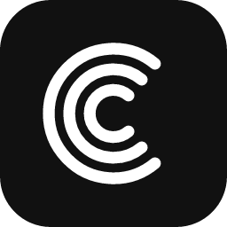
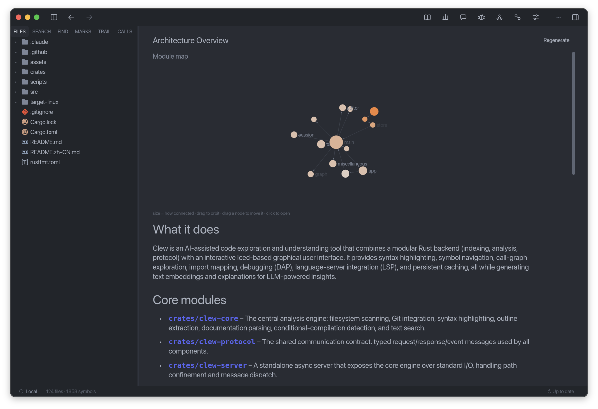
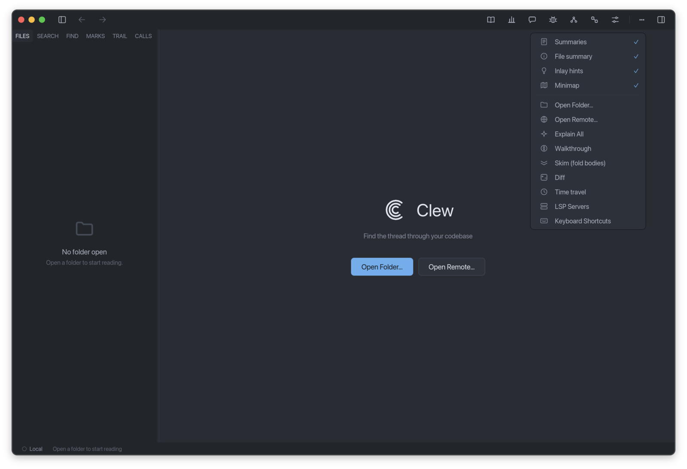

# Clew

**An AI-powered tool for analyzing and reading code**

 &nbsp;  &nbsp;  &nbsp; 

**English** &nbsp;|&nbsp; [简体中文](README.zh-CN.md)

As LLMs advance, AI can already write code at the scale of a whole repository. But we drive that AI almost entirely in natural language, and natural language is not program semantics. It inevitably brings ambiguity and vagueness when it describes code. So reading, understanding, and analyzing code stays necessary for us. Clew is built for exactly that.

## Introduction

Clew is not an editor. It is a tool built specifically for **reading, understanding, and analyzing code**.

Whether you want to **quickly get up to speed on an unfamiliar project** by reading its existing code and learning its structure and implementation, or to carefully read, understand, and analyze **AI-written code** to confirm its semantics match what you intended and check it for bugs, Clew has you covered.

Unlike an editor or IDE, Clew builds in a range of capabilities made for reading code. There are **non-AI features** like import graph, call graph, reading trail, bookmarks, symbol-aware notes, codebase statistics, LSP, and debugger, and there are **AI-powered features** like Architecture Overview, Ask Clew, Explain, Semantic Search, and Walkthroughs.

## Quick start

Download the latest Clew from [Releases](https://github.com/RutaTang/Clew/releases/latest). On the welcome screen, click **Open Folder** and open the codebase you want to read. Then click the **⋯** button in the top right to open the menu and choose **Tutorial**, and Clew will walk you through how to use it right inside the project you opened.

## Features

- 🗺️ **The big picture**: Looking at a project from a high level helps you grasp what it is overall, how it is structured, and why it is designed the way it is. Clew gives you an AI-powered **Architecture Overview** and a **Code Statistics** view, so you can catch the main architecture and understand the project as a whole.
- 💬 **Ask Clew**: Questions come up constantly while reading code, like "where is Authentication done?" or "why is this written this way?". Clew gives you an AI agent that knows your whole project and answers with grounding in its actual content.
- 🕸️ **Call Graph and Import Graph**: To see which modules depend on which, and which functions call which, plain reading rarely adds up to a full picture. Clew draws the import and call relationships as a live 3D force-directed map you can orbit, spin, and drag, colored by language and hierarchy depth, with arrows marking the direction of dependency and cycles highlighted, so the structure of the code is visible at a glance.
- 🧭 **Walkthrough**: Getting into a new project is rarely easy. Whether you want to understand the project's main flow and the code it involves, or a specific feature's flow and code, and figure out where to start and what order to read in, it takes work. Clew's AI-powered **Walkthrough** can, for the whole project or a specific question, generate an ordered, code-anchored guided tour that walks you step by step through the key files and functions and lays out the main thread of reading.
- 🕰️ **Time Travel**: When you can't figure out why a piece of code is written the way it is, you often need to look back at what it used to be, when it changed, and why it became what it is now. Clew's **Time Travel** lets you drag along a timeline to roll any file back to any version in its git history. For a specific function, it can also generate an AI-powered **story** that explains how that function evolved into its current shape.
- 🔌 **Bring your own model**: The language model behind Clew's AI features is swappable and not tied to any single vendor. You can enter your own LLM provider's API key and endpoint in the settings.

## Language support

To analyze code well, Clew tailors its support to each language's characteristics. Its features currently support Rust, Python, TypeScript/JavaScript, Go, and Dart well, and other languages get some basic support for now, such as syntax highlighting. More languages are coming.

## Contributing

Clew is still early, and all kinds of input are welcome and hoped for, whether feature requests, bug reports, or pull requests.
